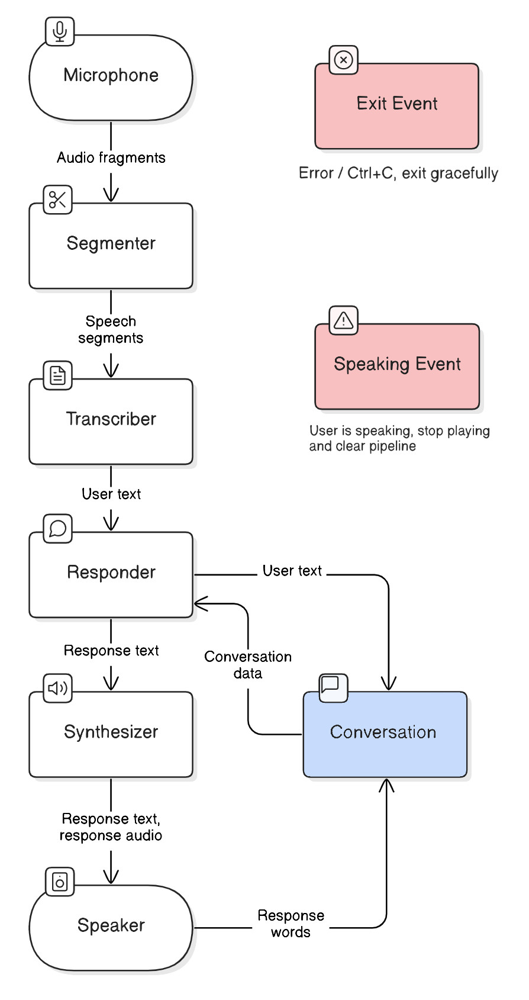

# aspen
Aspen is your personal voice assistant, ready to chat in real time! Call its dedicated phone number or use your microphone and speakers for seamless voice-to-voice interaction, all for $0.01025/min.

## Cost Breakdown
| Service                | Per-Minute Cost                                |
|------------------------|------------------------------------------------|
| Twilio (phone calls)   | $0.008/min                                     |
| Groq (transcription)   | Free (limit: 20req/min)                        |
| Claude-3.5 (responses) | $0.00225/min (estimate: $15/MOutput * 150 wpm) |
| Google Cloud (speech)  | Free (up to 1M chars per month)                |
| **Total**              | **$0.01025/min**                               |

## Installation
1. `git clone https://github.com/thooton/aspen`
2. `cd aspen`
3. `python3 -m pip install -r requirements.txt`

## Setup
1. Copy the example configuration, `priv/config.json.example`, to `priv/config.json`.
2. Sign up for [Groq](https://console.groq.com/), then put your API key in the config under `transcriber -> api_key`.
3. Sign up for [Anthropic](https://console.anthropic.com/), and add some credits. Put your API key in the config under `responder -> api_key`.
4. Sign up for the [Google Cloud Text-to-Speech API](https://sonaar.io/docs/how-to-get-google-cloud-text-to-speech-api-key/). Download your service credentials as a JSON file and put them in `priv`, then update the path in `synthesizer -> credentials_path`.
5. (Optional) Sign up for the [Twilio free trial](https://console.twilio.com/), if you want to be able to call your assistant via phone number. Go through the setup process and then "purchase" a phone number with trial credits from Phone Numbers -> Buy a Number.

## Usage
### Local Usage
To use Aspen with your microphone and speakers:
```sh
python3 src/main_local.py
```

If all is well, Aspen will greet you with the message configured in your settings (default is "Hello, how are you?"). You can then speak into your microphone and hear Aspen's responses through your speakers!

### Twilio Phone Integration
To enable phone calls with Aspen:
1. Start the Twilio server:
   ```sh
   python3 src/main_twilio.py
   ```

2. Make your server publicly accessible using Cloudflare Tunnel:
   - Download the Cloudflare tunnel daemon from [their GitHub](https://github.com/cloudflare/cloudflared/releases/latest/)
   - Rename the file to `cloudflared` (Windows: `cloudflared.exe`)
   - On Linux, make the file executable:
     ```sh
     chmod +x cloudflared
     ```
   - Run the tunnel:
     ```sh
     ./cloudflared --url http://127.0.0.1:41903    # Windows: .\cloudflared.exe
     ```
     Note: Use your custom port number instead of 41903 if modified in config

   You'll receive a URL like: `https://your-tunnel-instance.trycloudflare.com`

3. Configure Twilio:
   - Open your Twilio console
   - Navigate to: Phone Numbers → Manage → Active numbers
   - Select your phone number
   - Under Voice Configuration → A call comes in:
     - Set to: Webhook
     - URL: `https://your-tunnel-instance.trycloudflare.com/incoming-call`
     - Method: HTTP GET

Your Aspen phone number is now ready to receive calls! Note: Unless you upgrade to a full Twilio account (which requires a $20 credit purchase), any calls not from the number you used to sign up to Twilio will be declined.

## Architecture
Aspen is divided up into several components. Each component runs on a separate thread, and has one input and one output queue, both unbounded. This keeps things simple and modular.



1. Input is received either through:
   - The user's microphone if running locally, or
   - A phone call to Aspen's Twilio number if using phone integration
2. For Twilio calls, a webhook request is made to our server, which returns a WebSocket endpoint that Twilio connects to.
3. Audio fragments are received either directly from the microphone or pushed by Twilio over WebSocket -- see [this article](https://www.twilio.com/en-us/blog/voice-ai-assistant-openai-realtime-api-python).
4. We detect "lulls" in the audio, indicating that the user has stopped speaking, using [silero-vad](https://github.com/snakers4/silero-vad).
5. We send the audio fragment to [Groq](https://console.groq.com/docs/speech-text)'s `distil-whisper-large-v3-en` for transcription to text.
6. We send the prompt to `claude-3.5-sonnet`. At the English average of 150 words per minute, we'll have ~200 tokens per minute.
7. We send the response to Google Cloud's [Neural2](https://cloud.google.com/text-to-speech/pricing) speech synthesis model.
8. We send the result of the synthesis either to the speaker or back through the Twilio websocket.
9. We estimate the time that each word takes to be spoken, and append them one by one to the conversation state.

## Contributing
This repository is entirely open to any PRs/issues/suggestions :)
